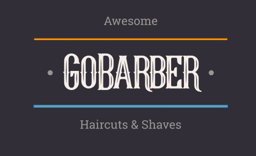

<h1 align="center">
   
</h1>

<h4 align="center"> 
	🚧 GoBarber 1.0 🚀 em construção... 🚧
</h4>

<p align="center">
  

  

  	
  <a href="https://www.linkedin.com/in/igortuag/">
    
  </a>
	
  
  <a href="https://github.com/igortuag/gobarber/commits/master">
    
  </a>

  
   <a href="https://github.com/igortuag/gobarber/stargazers">
    
  </a>
</p>


## 💻 Sobre o projeto

✂ GoBarber - forma de conectar barbeiros às pessoas que precisam melhorar seu visual.

Os profissionais poderão se cadastrar na plataforma web enviando:
- nome da entidade, email e senha
- e o endereço para que ele possa aparecer no mapa
- além de selecionar seus horários de disponibilidade

Os usuários terão acesso ao aplicativo móvel, onde poderão:
- navegar pelo app para ver os profissionais cadastrados e datas de disponibilidade
- entrar em contato com o profissional e/ou marcar um horario

Projeto desenvolvido durante o **Bootcamp - Go Stack** oferecido pela [Rocketseat].


## 🎨 Layout

O layout da aplicação está disponível no Figma:

<a href="https://www.figma.com/file/BXCihtXXh9p37lGsENV614/GoBarber?node-id=23%3A183">
  
</a>


### Mobile

	🚧 GoBarber 1.0 🚀 em construção... 🚧


### Web

	🚧 GoBarber 1.0 🚀 em construção... 🚧

## 🛠 Tecnologias

As seguintes ferramentas foram usadas na construção do projeto:

- [Node.js][nodejs]
- [React][reactjs]
- [React Native][rn]
- [TypeScript][typescript]


## 🚀 Como rodar este projeto

Podemos considerar este projeto como sendo divido em três partes:
1. Back End (pasta backend) 
2. Front End (pasta frontend) 🚧 GoBarber 1.0 🚀 em construção... 🚧
3. Mobile (pasta mobile) 🚧 GoBarber 1.0 🚀 em construção... 🚧

💡Tanto o Front End quanto o Mobile precisam que o Back End esteja sendo executado para funcionar.

### Pré-requisitos

Antes de começar, você vai precisar ter instalado em sua máquina as seguintes ferramentas:
[Git](https://git-scm.com), [Node.js][nodejs]. 
Além disto é bom ter um editor para trabalhar com o código como [VSCode][vscode]

### 🎲 Rodando o Back End (servidor)

```bash
# Clone este repositório
$ git clone https://github.com/igortuag/gobarber

# Acesse a pasta do projeto no terminal/cmd
$ cd gobarber

# Vá para a pasta server
$ cd server

# Instale as dependências
$ npm install

# Execute a aplicação em modo de desenvolvimento
$ npm run dev:server

# O servidor inciará na porta:3333 - acesse http://localhost:3333 
```

## 📝 Licença

Este projeto esta sobe a licença MIT. Veja a [LICENÇA](license) para saber mais.

Feito com ❤️ por Igor Tuag 👋🏽 [Entre em contato!](https://www.linkedin.com/in/igortuag/)